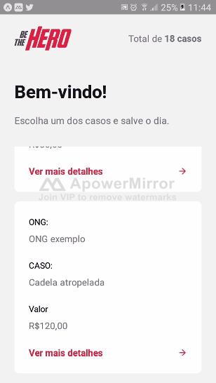

# Projeto desenvolvido no evento "Semana Omnistack 11.0"

##  ***Ideia do Projeto***

#### &nbsp; &nbsp; A ideia do projeto consiste em uma aplicação completa envolvendo _Backend_, _Frontend_ e _Aplicativo Mobile_ que visa facilitar a comunicação entre ONGs e pessoas que desejam ajuda-las em seus casos, no caso, os heróis.   
### Tecnologias usadas:

* #### NodeJS no Backend 
* #### ReactJS no Frontend
* #### React Native no Mobile

## ***Demonstrando a aplicação***

## Website

## 

#### &nbsp; A parte do website será reservado para a ONG se cadastrar e cadastrar seus casos Após o usuário acessar o site, ele terá a opção de fazer login com seu ID, caso ele não  possua, terá a opção de fazer um cadastro, após a conclusão ele receberá seu ID de acesso e será redirecionado para a página de login.

## 

#### Após ter feito o Login, aparece uma página listando todos os casos que a ONG registrou. Na página de cadastro de novos casos é pedido informações que serão apresentados ao heroi que salvará no caso.

## Aplicativo mobile

## 

#### Acessando o aplicativo, o herói terá acesso à uma lista dos casos que ele pode auxiliar, clicando em alguma delas ele terá a possibilidade de entrar em contato por Email ou por WhatsApp com a ONG, o email e o número acessados serão os que a ONG colocou na hora de seu cadastro.      

## ***Processo de construção da aplicação***

## Backend

#### O Backend como já dito antes foi desenvolvido em Node com alguns frameworks e bibliotecas de auxilio. Abaixo está algumas das *dependencias* utilizadas:  

### ***Express***
#### O sistema que relaciona as informações contidadas na url com operações na aplicação, como requisições ao banco de dados(método GET) ou adição de informações no banco(método POST) foi criado com o micro-framework *Express*.
~~~javascript
const express = require('express')
const OngController = require('./controllers/OngController')
const incidentController = require('./controllers/incidentController')
const routes = express.Router()
//Cria ONGs
routes.post('/ongs', OngController.create)
//Lista as ONGs 
routes.get('/ongs', OngController.index)
~~~
#### No exemplo acima, se um usuário colocar **/ongs** no final da url, ele estará executando método GET e tendo como retorno a lista de ONGs existente no banco de dados, isto caso ele tenha autorização para tal.    

### ***Knex e o Banco de Dados SQLite***
#### O banco de dados utilizado foi o *SQLite*. E o Knex foi utilizado com ele. Abaixo temos o script de conexão com o banco.
~~~javascript
const knex = require('knex')
const configuration = require('../../knexfile')
const config = configuration.development
const connection = knex(config)
module.exports = connection
~~~
#### Migration que cria tabela no banco de dados:
~~~javascript
exports.up = function(knex) {
  return knex.schema.createTable('ongs', function(table){
      table.string('id').primary()
      table.string('name').notNullable()
      table.string('email').notNullable()
      table.string('whatsapp').notNullable()
      table.string('city').notNullable()
      table.string('uf', 2).notNullable()
      
  })
}
exports.down = function(knex) {
    return knex.schema.dropTable('ongs')
};
~~~

### ***Crypto***
#### Uma biblioteca que foi usada para criar o ID
~~~~javascript
const crypto = require('crypto')
const generateUniqueId = function generateUniqueId(){
    return crypto.randomBytes(4).toString('HEX')
}
module.exports = generateUniqueId
~~~~

#### **Outras dependencias foram usadas somente em ambiente de desenvolvimento, como "nodemon" e "celebrate".**      

## Frontend

#### No caso do Frontend foi-se usado o ReactJS, também com algumas dependencias externas. Abaixo está algumas das *dependencias* utilizadas: 

### ***Axios***

#### O *axios* é uma ferramenta que foi utilizada para viabilizar a conexão com a API backend de maneira simples.
~~~~javascript
import axios from 'axios'
const api = axios.create({
    baseURL: 'http://localhost:3333',
    
})
export default api
~~~~
#### A *baseURL* está como http://localhost:3333 pois esse é o endereço até nosso backend, caso você esteja rodando o Backend em outro endereço, terá que modifica-lo, caso você esteja rodando no Gitpod por exemplo.     

### ***React Router Dom***

#### O sistema de navegação que o usuário utiliza para ir de uma página pra outra foi construido com o "react-router-dom".
~~~~javascript
import React from 'react'
import { BrowserRouter, Route, Switch } from 'react-router-dom'
import Logon from './pages/Logon'
import Register from './pages/Register'
import Profile from './pages/Profile'
import NewIncident from './pages/NewIcident'
export default function Routes() {
    return (
        <BrowserRouter>
            <Switch>
                 <Route path="/" exact component={Logon}></Route>
                 <Route path="/register" component={Register}></Route>
                 <Route path="/profile" component={Profile}></Route>
                 <Route path="/incidents/new" component={NewIncident}></Route>
            </Switch>
        </BrowserRouter>
    )
}
~~~~

####       

## Mobile

#### Além de *React Native*, para construção do *app* foi usado junto com ele o *Expo*. Novamente, logo abaixo estão as dependencias utilizadas:  

### ***React Navigation***

#### Este executou a mesma função do "react-router-dom"
~~~~javascript
import React from 'react'
import { NavigationContainer } from '@react-navigation/native'
import { createStackNavigator } from '@react-navigation/stack'
const AppStack = createStackNavigator()
import Incidents from './pages/Incidents'
import Detail from './pages/Detail'
export default function Routes() {
    return (
        <NavigationContainer>
            <AppStack.Navigator screenOptions={{headerShown: false}}>
                <AppStack.Screen name="Incidents" component={Incidents}/>
                <AppStack.Screen name="Detail" component={Detail}/>
            </AppStack.Navigator>
        </NavigationContainer>
    )
}
~~~~
####    

### ***Axios***
#### Aqui também foi usado o *Axios*

~~~~javascript
import axios from 'axios'
const api = axios.create({
    baseURL: 'http://192.168.25.227:3333',
})
export default api
~~~~
####    

### ***expo-mail-composer***
#### Esta ferramenta foi usada para redirecionar o usuário para o seu aplicativo de email padrão
~~~~javascript
function sendEmail() {
    MailComposer.composeAsync({
        subject: `Herói do caso: ${incident.title`,
        recipients: [incident.email],
        body: message,
    })
}
~~~~
####    
### ***INTL***
#### Uma biblioteca que foi usada para formatação de dinheiro. O exemplo abaixo mostra a exibição do "value" do caso.
~~~~javascript
<Text style={styles.incidentValue}>{Intl.NumberFormat('pt-BR', {style: 'currency', currency: 'BRL'}).format(incident.value)}</Text>
~~~~